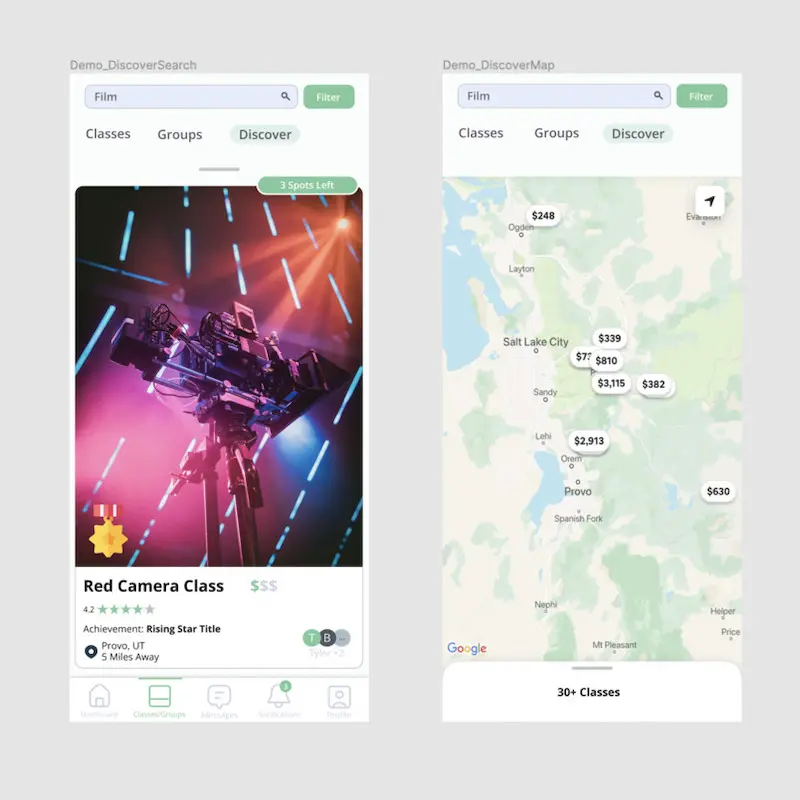
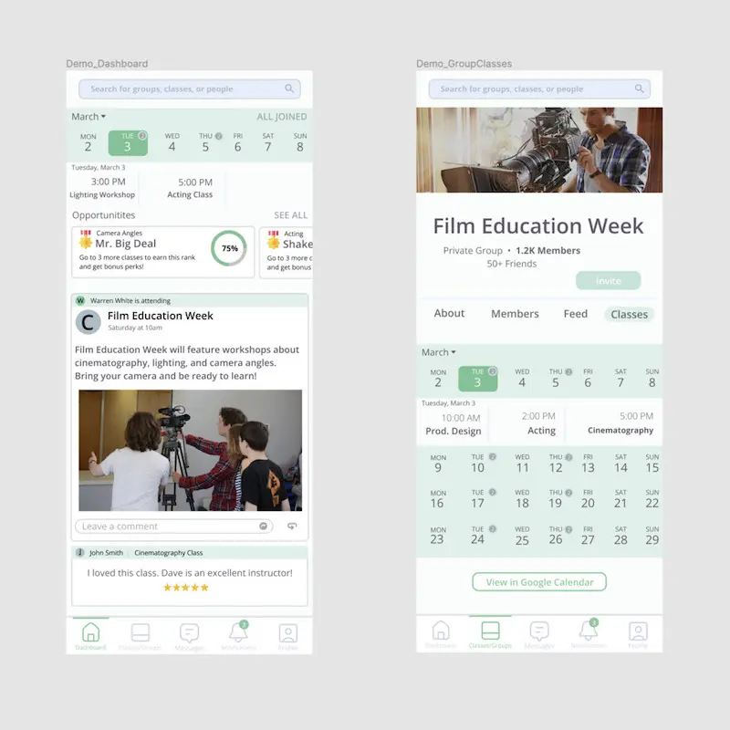

# Instruct.me

Uniting communities through localized classes

In BYU MSB 494 On Campus Internship class, I did an internship for Instruct.me, a small company looking to implement their idea of using localized classes to unite communities (example: Welder down the street wants to teach his trade to those interested). My team of 4 and I then locked in the next few months to create designs and bring the owner's idea to life. We leveraged Figma to create high fidelity mobile and then desktop app prototypes. The app code you see in the repo was only the beginning of our creation of the app as we spent most of our time throughout the semester really nailing down the designs.

See [this PDF](./README-assets/README-mobile-designs-user-guide.pdf) for the entirety of the mobile app design screenshots as well as a user guide.

See [this PDF](./README-assets/README-desktop-designs.pdf) for the desktop web app design screenshots (designs were made mobile-first then later adapted to the web).

[Midterm Presentation PDF](./README-assets/README-midterm-presentation.pdf)

[Final Report PDF](./README-assets/README-final-report.pdf)
